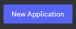
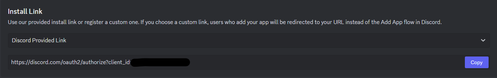

# AI Vtuber Discord Collab System (avdcs)

The goal of this project is to provide a unified and easy-to-use library in order to handle communications between parties during a livestreamed collab between 2 or more AI Vtubers.

## What the library does

- Uses Discord as a way to exchange text messages without hosting.
- Allows sending to and receiving of messages to/from a single or multiple collab partners on the Discord text channel.

## What it doesn't do

- Orchestration of the timings, the assumption is that the messages would be sent at the very end of playing the TTS.

## Supported languages

- Javascript/TypeScript
- Python
- C#

New languages can easily be added in the future.

## Requirements

1. Discord server with a text channel
2. Discord bot with read/write permissions
3. Python >=3.8

## Usage

#### Those are only examples making use of the functions provided by the library. Your implementation will and should be specific to the architecture of the AI Vtuber.

C#:

```c#
using AiVtDiscordCollabSystem;

await AVDCS.Initialize(
    token: "<TOKEN>",
    channel_id: "<CHANNEL ID>",
    python_path: "python",
    bot_path: "lib/collabbot.py");

while (true)
{
    AVDCS.IncomingMessage msg = await AVDCS.Receive();
    if (msg.text.Equals("quit")) break;

    Console.WriteLine(msg.sender + ": " + msg.text);
    await AVDCS.Send("This is a test", "all");
}
await AVDCS.Free();
```

JavaScript:

```js
const avdcs = require("./lib/avdcs");

await avdcs.initialize("<TOKEN>", "<CHANNEL ID>", {
  python_path: "python",
  bot_path: "lib/collabbot.py",
});

avdcs.receiveWithListener((msg, from) => {
  if (msg == "quit") {
    avdcs.free();
    process.exit();
  }
  console.log(from + ":", msg);
  avdcs.send("Test message", "all");
});
// or
let response = await avdcs.receiveAsync();
```

Python:

```python
import lib.avdcs as avdcs

avdcs.initialize(
    token="<TOKEN>",
    channel_id="<CHANNEL ID>",
    python_path=sys.executable,
    bot_path="lib/collabbot.py")

while True:
    msg = avdcs.receive_poll()
    if msg == None:
        time.sleep(0.1)
        continue
    if msg.text == "quit": break

    print(msg.sender + ": " + msg.text)
    avdcs.send("Test message", "all")

avdcs.free()
```

## How to setup

1. Copy the right version of the library, as well as the collabbot.py script to your project.
2. In the `initialize` function call, make sure to specify the path of the `collabbot.py` script within your project.
3. If not installed, install Python >=3.8 (in the installer, make sure to tick `add to PATH`)
4. Install the Python requirements using `pip install -r requirements.txt`
5. If using NodeJS, use `npm install ws`

## Get a Discord Bot Token

### 1. Create a Discord Bot on [Discord Developer Portal](https://discord.com/developers/applications)



### 2. Name the bot like your AI Vtuber (prefered), agree to the terms and hit `Create`


### 3. Go to the `Installation` tab, then set the install link to `Discord Provided Link`


### 4. Still on the `Ìnstallation` tab, add those scopes and permissions to the bot.


### 5. Go to the `Bot` tab, then toggle on `Message Content Intent`


### 6. Still on the `Bot` tab, hit `Reset Token`, it will show the Discord Bot Token. Copy it.


## Make Bot join Discord Server

### 1. Go to the `Installation` tab, then copy the Install Link



### 2. If you own the server, paste the link in any browser to make the Bot join the server of your choice. If you do not own the server, send the link to the server owner.


## Get Channel ID

### 1. Right click the target Discord text channel and click `Copy Link`


### 2. Paste the link somewhere


### 3. The Channel ID is the string of numbers following the last `/`
